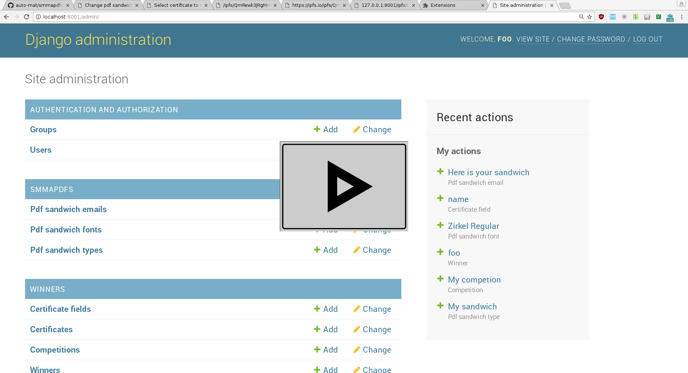

smmapdfs: Sudo make me a pdf sandwich
=====================================

smmapdfs is used for generating pdf files from django models by overlaying the text of fields onto a background pdf file. It differs from other django pdf apps such as `django-easy-pdf <https://django-easy-pdf.readthedocs.io/en/v0.2.0-dev1/>`_ and `django-pdfkit <https://github.com/alexhayes/django-pdfkit>`_ in that it is intended to be used by graphics designers wishing to overlay some text onto a pre-prepaired pdf background.

smmapdfs can further be used to send out emails with the pdfs. It was initially intended to send out diplomas at the end of a cycling competition.

Video tutorial:
---------------

Instalation:
------------

Sudo make me a pfd sandwich is published on Pypy as `django-smmapdfs <https://pypi.org/project/django-smmapdfs/>`_.

    pip3 install django-smmapdfs

Integration:
------------

See the example app for an example of how to integrate smmapdfs into your django application.

Configuration:
--------------

In smmapdfs admin:

- For each competition add a new pdfsandwich type, uploading a PDF and setting its size. There can only be one pdfsandwich type per competition
- For each pdfsandwich type and langauge add a pdfsandwich email

In your application's admin:

- For each pdfsandwich type add the fields you want displayed on the pdfsandwich, setting their coordinates left→right, bottom↑ᵘᵖ in millimeters

Generating pdfsandwichs:
------------------------

In your application's admin

- Select the objects you wish to to generate pdfsandwichs for
- Select the Make PdfSandwich action

Sending pdfsandwichs:
---------------------

- In your applications admin select the pdfsandwichs you want to send and use the send action

Notes about email formatting:
-----------------------------

The emails are sent as HTML messages. Text messages are created by stripping out the HTML tags. This means that links should be written in their full form.

SPAM
----

Please remember, both the United states and the EU have criminal penalties for sending unsolicited SPAM email messages. This app is not designed or intended for such a purpose. Please do not use it to send SPAM. (This note has no legal implications for licensing purposes. The software is licensed under the GNU LGPLv3.0)
